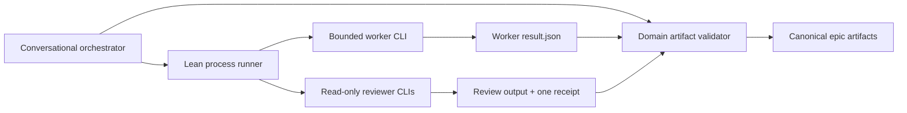

# Scope Control-Plane Bloat Removal Plan

## 1. Purpose

The worker refactor achieved its model-facing goal: Scope now gives advanced
models small, bounded jobs instead of one large conversational instruction set.
The worker prompts are approximately 1.5-2.4 KB each, model and effort routing
is explicit, and independent reviewers remain separate from authoring workers.

The control plane around those workers became substantially more complicated
than the problem requires. Live `epic_refine` dogfood on GD-003.6 showed that
most failures came from Scope's lifecycle, attribution, retry, metadata, and
artifact-reconciliation machinery rather than from workers misunderstanding
their jobs.

This plan removes that bloat. It is a deletion-first refactor, not a request for
a new workflow framework.

The intended reliability model is:

> small worker prompt + bounded authority + SOTA model + independent review

Software enforcement remains responsible for safety, process control, artifact
integrity, and mechanically checkable contracts. It must not attempt to replace
the semantic judgment of the workers and reviewers.

## 2. Success criteria

The refactor is successful when all of the following are true:

1. Workers still receive small, phase-specific instructions and no routing or
   orchestration policy.
2. An agentic write worker cannot silently write outside its declared boundary,
   follow a symlink outside the repository, change `HEAD`, or hide changes in
   ignored paths.
3. Reviewers remain independently launched, read-only, concurrent, and bound to
   immutable review inputs.
4. A provider crash, timeout, or cancellation has a deterministic status and a
   safe recovery path.
5. Product-contract approval, other material product decisions, and final
   approval remain explicit user authority unless the user hash-bound a
   preapproval for the current epic and artifact boundary.
6. Ordinary deterministic Scope actions do not perform whole-repository
   attribution scans or create operation receipts.
7. Each fact has one durable owner. Scope does not maintain metadata mirrors
   that must later be synchronized.
8. A clean small `epic_refine` run has no infrastructure retry and spends the
   large majority of elapsed time inside model calls.
9. The current control-plane production surface is reduced by at least 40%; the
   target is a 50-60% reduction without weakening the retained safety tests.
10. Every pre-existing runnable proof is executed once before refinement review
    and records real pass/fail/error/skip counts; implementation-created proofs
    are classified but not executed prematurely.

## 3. Current baseline

As of the GD-003.6 dogfood pass, the primary control-plane sources contain:

| Source | Lines | Main responsibilities currently combined |
|---|---:|---|
| `scope-worker.py` | 4,464 | provider launch, schemas, manifests, locks, process supervision, run state, incidents, recovery, trusted operations, dependency merge |
| `scope-reviewer.py` | 2,470 | packet interpretation, provider launch, Markdown parsing, output validation, isolation manifests, metadata, retry, preservation, receipts |
| `validate-refinement.py` | 5,822 | scaffolding, approvals, packet creation, receipt verification, finding application, correction receipts, phase validation, metrics |
| `audit-artifacts.py` | 4,560 | attempt preparation, gates, evidence, review synthesis, finding application, finalization, report and matrix validation |
| `scope-proof-preflight.py` | 406 | proof execution during refinement and result parsing |
| `scope_codegraph.py` | 447 | initialization, synchronization, compatibility, status, prompts, receipts |
| **Total** | **18,169** | |

The corresponding principal unit-test files contain approximately 13,940
lines. Test volume is not itself a defect, but much of it characterizes
intermediate state and compatibility machinery that this plan deletes.

`worker-runtime-policy.yaml` registers fourteen generic trusted-operation
types. A GD-003.6 review required fifteen operation receipts, including six
failed review operations and two failed review-application operations. The
active `run.yaml` grew to several megabytes because it embedded repository
manifests and accumulated operation, incident, and recovery state.

## 4. Design constraints

### 4.1 Preserve these capabilities

- Provider-local model and effort selection.
- Fresh bounded worker processes.
- Direct Codex and Claude CLI execution.
- Process timeout, cancellation, and process-tree cleanup.
- One active write worker per working root.
- Worker result schema validation.
- The write-containment invariant, including ignored paths and symlinks. The
  current implementation partially detects these cases; the lean runner must
  retain that detection and complete the preventive boundary.
- Exact commit-pinned dependency-baseline merge validation.
- Read-only independent reviewers with immutable input hashes.
- Evidence hashes for executed audit gates.
- Fail-loud handling of invalid, missing, or skipped required work.

### 4.2 Do not preserve these implementation details

- The current `run.yaml` schema.
- Generic trusted operations for Scope's own deterministic scripts.
- Per-reviewer metadata YAML files.
- Incident ledgers and automatic re-baselining.
- Worker profile transition history.
- The dedicated proof-preflight subsystem and premature execution of
  implementation-created proofs during refinement.
- Gate 0 and Gate 2 as mandatory approvals for every epic.
- Backward-compatible automatic recovery of unpublished v3 runs.
- Validators for prose style, word budgets, or architectural quality.

### 4.3 Non-goals

- Do not add a database, daemon, message bus, workflow engine, plugin protocol,
  or generalized transaction framework.
- Do not create an abstraction merely to make old and new lifecycles coexist.
- Do not weaken filesystem safety because the provider is a strong model.
- Do not eliminate independent review.
- Do not optimize model quality by lowering default model or effort choices.
- Do not redesign the epic's domain documentation unless two existing artifacts
  demonstrably own the same information.

## 5. Minimal target architecture



The target has four durable lifecycle concepts:

1. A small `run.yaml` that records command identity, selected profile, current
   job, completed job summaries, and compact CodeGraph status. User decisions
   never live in prunable runtime state.
2. One model-authored `result.json` per worker. Runner-owned execution facts are
   stored once in the completed-job row in `run.yaml`; there is no separate
   worker metadata mirror.
3. Reviewer Markdown outputs plus one `reviewer-receipt.yaml` containing all
   assignment execution metadata, hashes, decisions, and findings.
4. Canonical epic artifacts validated only at meaningful phase boundaries.

Runtime stdout, stderr, prompts, temporary snapshots, and cancellation markers
remain under `tmp_debug`. They are diagnostic files, not parallel workflow
state.

## 6. Bloat area 1: worker run state and attribution

### What is bloated

`scope-worker.py` currently embeds the command baseline and attributed
filesystem manifests in `run.yaml`, maintains active jobs and active operations,
records job receipts and operation receipts, creates incident rows, supports
incident resolution and re-baselining, tracks failed jobs separately, and
implements recovery lineage for republishing results.

This creates several representations of the same repository state. It also
turns every unrelated file change, generated cache, and Scope-owned runtime
file into a lifecycle concern. The GD-003.6 run exposed failures involving
`.DS_Store`, virtualenv symlinks, reviewer logs, resolved incidents, and stale
attribution baselines.

### Substantial simplification

Replace the current run record with:

```yaml
schema_version: 2
epic_id: gd-003.6
command: epic_refine
repository_root: /absolute/repository
working_root: /absolute/worktree
worker_profile: default
created_at: timestamp
updated_at: timestamp
active_job: null
completed_jobs:
  - job_id: gd-003.6-design-001
    phase: design
    provider: codex
    model: gpt-6-sol
    effort: max
    status: completed
    result_path: tmp_debug/.../result.json
    result_sha256: sha256:...
    changed_paths: [docs/epics/.../design.md]
    started_at: timestamp
    completed_at: timestamp
```

`run.yaml` never owns product decisions. Durable decisions live only in
`refinement-state.yaml`; a job references their IDs and artifact hashes when
they grant authority.

Delete from `run.yaml`:

- `command_baseline_manifest`;
- `attributed_manifest`;
- `active_operation`;
- `operation_receipts`;
- `failed_jobs` as a separate collection;
- `unattributed_change_incidents`;
- `profile_transitions`.

The worker profile is selected when the run starts. If the user requests a
different profile later, new jobs may name it explicitly; the run does not need
a mutable transition ledger.

### Retained write containment

This is a retained security outcome, not a fully implemented capability that
can simply be preserved. The current runner detects ignored entries and several
symlink cases, but preventive containment still depends on provider/OS
sandboxing. Complete the boundary while narrowing its bookkeeping:

- Capture one pre-job snapshot into the job's runtime directory, not into
  `run.yaml`.
- Capture one post-job snapshot after the provider exits.
- Compare actual paths with the declared write scope and the worker result.
- Include tracked, untracked, ignored, and symlink entries.
- Reject pre-existing escaping symlinks in write scopes before launch.
- Fail the job if it creates an escaping symlink or changes `HEAD`.
- Use provider/OS sandboxing as the preventive boundary. If a provider cannot
  enforce repository containment, retain the one pre/post filesystem snapshot
  for that provider rather than creating a second incident framework.

Walking ignored paths and resolving symlink targets has a real cost on large
repositories. Measure that cost separately from deleted deterministic-operation
scans; do not claim the resulting security scan as removable bookkeeping.

If a concurrent user edit makes ownership ambiguous, stop and report the
actual paths. Do not create an incident row, mutate an attribution baseline, or
attempt automatic ownership repair. The next worker gets a fresh baseline after
the orchestrator resolves ownership.

### Recovery after a crash

Recovery has only three cases:

1. Provider or runner is still alive: report `active` and do nothing.
2. Provider exited and `result.json` validates: complete the job once using the
   existing result and snapshots.
3. No valid result exists: mark the job `interrupted`, preserve its diff and
   logs, and require an explicit fresh job. Do not invent recovery lineage.

Keep the working-root lock, process identity, cancellation marker, timeout, and
process-tree termination. Remove recovery behavior that attempts to make an
invalid or unpublished result look like a normal completed job.

## 7. Bloat area 2: generic trusted operations

### What is bloated

The generic `operate` command wraps Scope's deterministic scripts in the same
manifest, lock, receipt, and recovery machinery as an untrusted model process.
It currently covers refinement scaffolding, gates, proof preflight, packet
creation, reviewer launch, review application, correction receipts, audit
preparation, audit gates, audit synthesis, audit finalization, and Git merge.

Most of those operations are already explicit Python functions with known input
and output paths. Wrapping them again added little safety and caused every
reviewer retry and review application to take roughly 1.5 minutes of repository
scanning.

### Drastic simplification

Delete the generic `operate` subcommand and the `trusted_operations` registry.

Call deterministic Scope artifact commands directly. Each command must:

- validate its explicit input paths;
- write only its documented outputs;
- use atomic replacement for durable YAML/Markdown;
- return non-zero on invalid input;
- be idempotent when repeated against unchanged inputs.

These commands do not need whole-repository manifests, operation IDs, or generic
operation receipts. Commands that mutate epic or audit artifacts must acquire
the same working-root mutation lock as a write worker, non-blocking, and fail
clearly when the root is busy. This prevents deterministic writes from being
misattributed to a live worker without restoring an operation framework. Their
canonical output is their receipt where a receipt is semantically necessary—for
example, the reviewer receipt—not a generic wrapper receipt.

The dependency-baseline merge is the only exception. Move it into a small
dedicated command such as `scope-dependency-merge.py`. Retain:

- exact `git merge --no-ff <full-commit>` argument matching;
- rejection of Git global options and repository redirection;
- dependency epic and full commit verification against the handoff;
- clean-worktree precondition;
- non-moving commit target;
- conflict-free preview;
- explicit `HEAD` change permission only for that exact operation;
- fixed documented merge label.

Do not retain a generic command executor merely for this one security-sensitive
operation.

## 8. Bloat area 3: reviewer lifecycle and metadata

### What is bloated

For every assignment, the reviewer currently owns prompt, output, metadata, and
log paths. The receipt duplicates much of the metadata. Retry and preservation
logic then reconciles the output, metadata, receipt, source snapshot, model
execution state, byte counts, hashes, and isolation manifest.

This duplication directly caused stale metadata and invalid-output recovery
failures during GD-003.6.

### Substantial simplification

Keep only:

- one immutable review packet;
- one Markdown output per reviewer assignment;
- one log per assignment under `tmp_debug`;
- one reviewer receipt containing all assignment execution facts.

Delete per-assignment `metadata-*.yaml` files and their synchronization logic.
Do not store byte counts for prompt, output, metadata, and log unless a specific
security check consumes them. Retain content hashes for the packet, template,
output, and receipt.

The reviewer lifecycle becomes:

1. Validate packet and assignment list.
2. Hash packet and review template.
3. Preflight required provider CLIs.
4. Launch assignments concurrently with direct read-only CLI flags.
5. Validate each Markdown contract.
6. Write one receipt atomically.

Retry rules become:

- completed output with matching hash: preserve;
- infrastructure failure before a semantic result: rerun only that assignment;
- timeout or provider failure after semantic output: fail loudly;
- invalid Markdown contract: create a new review attempt, not an
  infrastructure repair of the same semantic attempt.

Reviewers already have no Write/Edit tools and only query-scoped CodeGraph Bash
permissions. Therefore remove full filesystem isolation manifests for reviewers.
Retain a cheap `HEAD`/tree identity check before and after the review as defense
in depth. A reviewer process that changes either value fails.

## 9. Bloat area 4: worker result schema

### What is bloated

The common worker result schema includes phase duplication, classified changed
paths, proposed audit artifacts, validation result counts, multi-option user
questions, `question_discovery`, concerns, durable-evidence requirements, and
status-dependent normalization rules. The runner contains extensive semantic
validation and transport repair for this universal schema.

Some fields are useful, but combining every role into one schema makes simple
worker jobs harder to produce and harder to recover.

### Substantial simplification

Use a small common envelope:

```json
{
  "schema_version": 2,
  "job_id": "...",
  "status": "completed | needs_user | blocked | failed",
  "summary": "...",
  "changed_paths": ["path"],
  "validations": [
    {"command": "...", "exit_code": 0, "summary": "..."}
  ],
  "questions": [],
  "issues": [],
  "payload": {}
}
```

Use small role-specific payload schemas only where needed:

- refinement payload: authored artifact paths and surfaced product decisions;
- implementation payload: implementation notes and proof evidence references;
- audit synthesis payload: proposed normalized findings;
- diagnostic payload: cause, evidence, and recommended next action.

Delete:

- `phase` from the result because the job already owns it;
- worker-authored authorization classification for changed paths—the runner
  compares actual paths with write scope;
- `question_discovery` and its normalization logic;
- audit-only `proposed_artifacts` from the common schema;
- parsed passed/failed/error/skipped counts as a universal requirement;
- transport repair that deletes or rewrites semantically populated fields.

Every worker prompt retains one simple rule: investigate as far as current
inputs permit and batch every currently discoverable blocking question before
returning `needs_user`. The `questions` list is the contract; no separate
question-discovery attestation or anchor grammar is required.

The common envelope records validation commands and exit codes. Implementation
proofs, pre-review baseline proof runs, and audit test gates use a dedicated
evidence row that also records passed, failed, error, and skipped counts. A zero
exit code cannot override non-zero failure/error counts or an unexplained skip.
Refinement-only structural validation does not require generic parsed counts.

## 10. Bloat area 5: refinement artifacts and validator

### What is bloated

`validate-refinement.py` is simultaneously a scaffolder, approval ledger,
review-packet factory, review-receipt verifier, findings merger, correction
receipt materializer, metrics generator, and multi-phase validator. It also
checks many cross-file prose conventions and maintains several intermediate
workflow artifacts.

The current artifact set gives the same facts multiple owners: refinement
profile, requirements manifest, acceptance traceability, approval ledger,
handoff candidate, correction receipts, findings, review receipt, and final
handoff documents.

### Canonical target artifacts

Keep human-facing delivery artifacts:

- `acceptance-criteria.md`;
- `design.md`;
- `file-plan-story-*.yaml`;
- `details.md`;
- `refinement-review.md`.

Keep machine-owned review artifacts:

- immutable `reviews/<review-id>/review-packet.yaml`;
- reviewer Markdown outputs;
- `reviews/<review-id>/reviewer-receipt.yaml`;
- `refinement-findings.yaml`.

Replace overlapping machine workflow artifacts with two canonical files:

1. `delivery-manifest.yaml`: epic risk/capabilities, acceptance IDs, decisions,
   artifact ownership, story assignments, and proof references. This replaces
   separate profile, requirements-manifest, and acceptance-traceability facts.
2. `refinement-state.yaml`: workflow status, explicit user decisions, final
   approval hash, completed review IDs, and the active findings reference. This
   replaces the approval ledger, handoff candidate state, and correction-receipt
   ledger.

Worker results remain in runtime storage and are referenced by job ID and hash
from `run.yaml` only for operational diagnostics. No permanent artifact may
depend on that prunable reference. When a finding is corrected or closed, copy
the exact command, exit code, pass/fail/error/skip counts where applicable,
affected paths, content/evidence hashes, and source review candidate IDs inline
into its `refinement-findings.yaml` row. Permanent validation reads that row,
not `tmp_debug`, `run.yaml`, or a worker result.

### Validator target

Split authoring from validation conceptually, but avoid a framework:

- a small artifact builder for packet/state updates;
- a validator that reads the canonical artifacts and returns a list of errors.

The validator should check only:

- YAML/JSON shape and duplicate keys;
- required files and unique IDs;
- acceptance/decision/story/proof reference integrity;
- reviewer packet and receipt hashes;
- finding status and closure evidence;
- no unresolved blocking finding before final approval;
- final approval hash matches current final artifacts;
- implementation handoff contains all required story/proof assignments.

Remove validation of prose word budgets, possible normative statements,
stylistic completeness, and architectural quality. Those belong to SOTA
reviewers. A validator may confirm that a required heading exists, but must not
attempt to judge whether its prose is good.

## 11. Bloat area 6: gates and approvals

### What is bloated

Every refinement follows three fixed gates even when no user authority is
needed. Gate recording hashes multiple intermediate artifacts and is itself a
trusted operation. This adds interaction and stale-approval failure modes but
does not make a strong worker follow instructions more reliably.

### Substantial simplification

Retain only two normal user gates:

1. **Product contract:** after observable behavior, negative cases, success
   measures, and product decisions are concrete, before detailed architecture.
2. **Final handoff:** after independent review and corrections, against exact
   final artifact hashes.

Eliminate Gate 0 and Gate 2 as universal phase gates. Between the two retained
gates, the orchestrator stops only when:

- a worker or reviewer identifies a genuine product decision;
- scope, architecture, cost, risk, or external behavior materially changes;
- required evidence or authority is unavailable.

The user may explicitly preapprove either retained gate for the current epic.
The preapproval must name the gate and epic and be hash-bound to the applicable
input boundary before it can be consumed. Record approvals and decisions once
in `refinement-state.yaml` with source, timestamp, scope, and artifact hash. Do
not create a separate approval ledger or require approval for ordinary phase
progression.

## 12. Bloat area 7: proof preflight

### What is bloated

Refinement currently routes every planned proof through a dedicated helper,
generic trusted operation, count parser, evidence file, and validation path.
That machinery is excessive, but executing a pre-existing runnable regression
surface is valuable: the SAG-112 evaluation deliberately found 27 passing and
2 failing tests before review.

### Drastic simplification

Delete `scope-proof-preflight.py` and its trusted-operation wrapper, but retain
the proof-viability behavior in the handoff worker.

During refinement, require every proof to have:

- a stable proof ID;
- an owning story;
- a command or explicit implementation-created path;
- an expected result;
- a declared test level or inspection type;
- a preimplementation classification of `existing_runnable`,
  `implementation_created`, or `external_blocked`.

The handoff worker executes each `existing_runnable` command exactly once before
review and records command, exit code, and actual pass/fail/error/skip counts in
the durable delivery manifest. `implementation_created` proofs are not executed
prematurely. `external_blocked` requires a concrete blocker and substitute or
later authority. These are baseline viability results, not final implementation
proof.

Implementation reruns the proof after the relevant code exists and records its
exact durable evidence. Audit verifies the evidence and hashes and reruns
risk-appropriate gates. This preserves the SAG-112 early-warning control while
deleting the separate proof-execution subsystem.

## 13. Bloat area 8: CodeGraph lifecycle

### What is bloated

Workers and reviewers independently prepare CodeGraph, perform compatibility
checks, synchronize the index, build prompt instructions, and copy status into
multiple receipts. Degraded synchronization produced more orchestration work
without changing the semantic fallback.

### Substantial simplification

Prepare CodeGraph once per Scope command run:

1. Check the installed version.
2. Initialize, compatibility-check, and synchronize once when enabled.
3. Store one compact status row in `run.yaml`.
4. Pass the index path and query guidance to eligible jobs.
5. If preparation fails, record one degraded reason and use direct reads/`rg`
   for the rest of the run.

For `implement`, run one cheap incremental synchronization before each new write
job because the preceding story may have changed indexed code. Refinement and
read-only audit synchronize only once. Do not create per-job CodeGraph receipts
or repeat version/compatibility checks. Keep query permissions read-only.

## 14. Bloat area 9: audit lifecycle

### What is bloated

`audit-artifacts.py` owns preparation, repository fingerprinting, gate recording,
metrics, review source capture, synthesis snapshots, proposal application,
finding normalization, verification matrices, finalization, and validation.
Several intermediate files exist to prove that another intermediate file came
from the same reviewer receipt.

### Substantial simplification

Keep one canonical `audit-attempt.yaml` containing:

- attempt identity and mode;
- repository/implementation fingerprint;
- required acceptance IDs and gates;
- gate commands, results, evidence paths, and evidence hashes;
- review packet and receipt hashes;
- synthesis worker job ID/result hash;
- final decision and reason.

Keep `audit-findings.yaml` as the canonical finding ledger and retain the final
human `epic_audit.md`. Keep a verification matrix only if implementation or
downstream tooling consumes it; otherwise derive it when rendering the report.

Delete separate metrics records and immutable synthesis-capture files. The
synthesis worker receives the already hash-bound attempt, gate rows, reviewer
receipts, and existing findings. Its role-specific result proposes normalized
finding changes. A small applier verifies referenced source IDs and hashes, then
updates the finding ledger atomically.

Retain strict rules that:

- failed deterministic gates cannot be overridden by reviewers;
- every valid reviewer receipt candidate is ingested even when its assignment
  or aggregate decision is FAIL or BLOCKED; `skipped_reason` cannot discard a
  receipt that contains semantic output;
- correlated candidates use the maximum reported severity, and conflicting
  dispositions are not field-merged or silently downgraded—they block synthesis
  for explicit adjudication;
- PASS requires every required gate and reviewer;
- evidence hashes must still match at finalization;
- accepted risk and not-applicable gates reference a hash-bound authorization
  row naming the gate/finding, scope, repository fingerprint, source, and user
  decision; free-text justification alone is insufficient;
- test gates record exit code plus pass/fail/error/skip counts, and a zero exit
  code cannot hide failures, errors, or unexplained skips;
- targeted review can close only findings it was assigned.

Port audit only after the lean `epic_refine` and `implement` paths prove the
common runner and reviewer lifecycle.

## 15. Bloat area 10: command prompts

### What is bloated

The public command files still contain detailed shell orchestration for init,
preflight, status, recovery, profile mutation, generic operations, proof
preflight, packet creation, reviewer preflight, review application, and receipt
materialization. This makes the conversational orchestrator responsible for
reconstructing a long imperative protocol.

### Substantial simplification

Each public command should describe:

- its outcome and stop conditions;
- the small sequence of worker/reviewer phases;
- when user authority is required;
- the canonical artifacts at each boundary;
- one invocation form for the lean runner and domain validator.

Remove generic-operation shell snippets and internal recovery algorithms from
the prompt. The CLI owns process mechanics; the orchestrator owns decisions and
status explanations.

Target a further 40-50% reduction in the combined `epic_refine`, `implement`,
and `audit_epic` command bodies, provided no user-facing safety rule is lost.

## 16. Additional cross-cutting deletion targets

Apply these only when their named consumer disappears in the same stage:

- Delete the generalized durable `path#anchor` grammar engine. Canonical
  decisions and closure evidence use stable IDs, paths, and hashes; ordinary
  questions and concerns do not need eight symbol grammars.
- Record the requested model/effort and raw provider `modelUsage`. Remove the
  inferred fallback-family taxonomy. Retain a simple explicit fallback flag
  only when the provider or configured fallback path reports one.
- Fold surviving worker timeout, grace, heartbeat, and provider knobs into the
  provider policy files after generic trusted operations disappear. Do not keep
  an otherwise empty runtime policy merely to preserve file count.
- Replace prose-pinning PR-check greps with black-box behavior tests. Retain
  install-destination checks, mirrored-source checks, and narrow banned-pattern
  checks for removed or unsafe behavior.
- Slim the job packet to mechanical identity, roots, scopes, artifacts, result
  path, required validation/proof IDs, and hash-bound decision references.
  Story-specific constraints and stop conditions remain in canonical artifacts
  and the rendered role prompt, not duplicated packet prose.

The platform `developer.md` agents are installed public surfaces. Verify whether
direct invocation is still supported before deleting them; internal non-use is
not sufficient evidence. `wrap_epic.md` was deferred from the worker-lifecycle
rewrite and is addressed as the separate deletion-first stage in Section 23.

## 17. Migration policy

Do not build transparent compatibility for old v3 runtime state.

- Existing canonical epic documents and review outputs remain usable.
- Existing large run directories may be archived under `tmp_debug` for forensic
  reference.
- A lean run imports only canonical epic artifacts, explicit user decisions,
  open findings, and completed reviewer outputs whose hashes still verify.
- It does not import incident ledgers, operation receipts, attributed manifests,
  stale metadata files, or recovery lineage.
- If an old active run is detected, fail with one clear archive/restart command.
  Do not auto-migrate ambiguous unpublished changes.

GD-003.6 should retain its authored epic artifacts and current findings, archive
the existing runtime ledger, and restart at the appropriate lean correction or
review boundary. It should not rerun completed semantic work merely to populate
new lifecycle metadata.

## 18. Implementation sequence

### Stage 0: freeze the behavioral boundary

1. Record current CLI entry points, canonical artifacts, model routing, and the
   retained security invariants.
2. Add a thin black-box safety spine for successful, needs-user, timeout, cancellation,
   out-of-scope write, ignored-file write, escaping symlink, reviewer read-only,
   and exact dependency-merge cases.
3. Retain supervisor-death/orphan and real Windows installer execution tests.
4. Stop adding compatibility behavior to the current lifecycle.

Do not rewrite the approximately 14,000 existing test lines before deletion.
Delete obsolete implementation-coupled tests with each removed subsystem and
add only tests that protect an external behavior or retained security boundary.

Exit condition: the tests describe desired external behavior without asserting
the current internal run/metadata/incident shapes.

### Stage 1: reduce the common worker result

1. Introduce the v2 common envelope and small role payload schemas.
2. Update worker prompts to return v2 directly.
3. Remove semantic transport normalization and `question_discovery`.
4. Keep v1 only long enough to finish or archive already-running jobs; do not
   support mixed v1/v2 jobs inside one lean run.

Exit condition: all four worker roles complete fake-provider black-box tests
with one result file and no metadata sidecar.

### Stage 2: replace the run lifecycle in place

1. Introduce small `run.yaml` v2.
2. Retain one working-root lock and one active job.
3. Move pre/post snapshots to write-job runtime directories.
4. Implement the three-case recovery model.
5. Delete incidents, re-baselining, profile transitions, active operations, and
   operation receipts.
6. Remove `set-profile`, `resolve-incident`, and generic `operate` commands.

Exit condition: worker success, crash, cancellation, concurrent-edit, and
out-of-scope-write tests pass with no incident or operation state.

### Stage 3: simplify reviewers

1. Remove metadata sidecars and full repository manifests.
2. Keep direct provider CLI preflight and concurrent launch.
3. Write one authoritative receipt.
4. Replace repair-state branching with the simple retry rules in Section 8.
5. Preserve immutable packet/template/output hashes and `HEAD`/tree checks.

Exit condition: mixed Claude/Codex review completes in one invocation; one
provider infrastructure failure reruns only that provider; invalid semantic
output never receives an infrastructure retry.

### Stage 4: simplify `epic_refine`

1. Introduce `delivery-manifest.yaml` and `refinement-state.yaml`.
2. Retain only the product-contract and final hash-bound gates.
3. Move pre-existing proof viability execution into the handoff worker and
   delete the dedicated proof-preflight subsystem.
4. Remove approval and correction-receipt ledgers.
5. Reduce the refinement validator to structural and referential integrity.
6. Update the command prompt to the lean phase sequence.
7. Archive the existing GD-003.6 runtime and resume from its canonical
   artifacts/findings.

Exit condition: a clean GD-003.6-equivalent refinement reaches first findings
with zero infrastructure retry and no intermediate metadata repair.

### Stage 5: dogfood and measure before porting

Run one small real epic with default workers and reviewers. Record:

- model calls and duration per call;
- deterministic overhead;
- filesystem scan count and duration;
- number of durable runtime/artifact files;
- user interruptions;
- infrastructure retries;
- reviewer findings and final artifact quality.

Do not port `implement` or `audit_epic` until the lean refinement path passes.

### Stage 6: port `implement`

1. Reuse the lean worker lifecycle.
2. Keep per-story workers and epic verification.
3. Run proofs here, after implementation exists.
4. Move the exact dependency merge into its dedicated secure command.
5. Keep audit remediation as a bounded implementation phase.

Exit condition: a small implementation completes with scoped writes, proofs,
cancellation/recovery, exact merge safety, and no generic operations.

### Stage 7: port `audit_epic`

1. Introduce the canonical audit attempt shape.
2. Collapse capture/apply/metrics intermediates.
3. Reuse the lean reviewer receipt.
4. Keep evidence hashes, deterministic gate precedence, and strict PASS logic.
5. Remove unused matrix/snapshot files only after confirming no downstream
   consumer.

Exit condition: full and targeted audit paths pass black-box tests and one live
dogfood run without duplicated reviewer or synthesis metadata.

### Stage 8: delete obsolete code and tests

Delete, rather than deprecate indefinitely:

- generic trusted-operation code and policy;
- incident/re-baseline/recovery-lineage code;
- metadata-sidecar code;
- proof-preflight script and tests;
- old run-schema compatibility;
- validators and fixtures for removed intermediate artifacts;
- prompt text describing removed mechanics;
- installer cleanup after one release has removed stale installed assets.

Exit condition: searches for removed concepts find only migration notes and
release history.

## 19. Verification strategy

### Retained security tests

- Exact Git dependency merge rejects `-c`, `-C`, branch tips, foreign repos,
  extra arguments, wrong epic, and wrong commit.
- A tree-neutral merge cannot smuggle an unauthorized commit.
- Root write scope works.
- Tracked, untracked, and ignored out-of-scope writes fail.
- Existing and newly created escaping symlinks fail.
- Reviewers cannot use Write/Edit/NotebookEdit/Task/Agent or arbitrary Bash.
- Provider process trees terminate on cancel and timeout.
- Supervisor death with a surviving provider child is classified and recovered
  without orphaning an uncontrolled writer.
- Unix installation and the real Windows `install.bat` CI job install the same
  required assets.
- A crash after result creation can finalize exactly once.
- A crash without a valid result never auto-publishes changes.
- Evidence hashes are verified at audit finalization.
- Final approval becomes stale when a final artifact changes.

### Workflow black-box tests

- `epic_refine`: clean completion, user decision, reviewer correction, targeted
  closure, final approval, and preapproved final gate.
- `implement`: story success, failed validation, debugging, cancellation,
  dependency baseline, epic verification, and audit remediation.
- `audit_epic`: failed deterministic gate, full review, targeted closure,
  accepted risk, not applicable with authority, final PASS/FAIL/BLOCKED.

Tests should assert observable commands, files, decisions, and safety outcomes.
They should not assert private helper topology or obsolete intermediate YAML.

Coverage is not a migration-stage blocker while large obsolete surfaces are
being deleted, per current user direction. Restore the repository threshold
after the lean surface stabilizes; do not add low-value tests merely to preserve
coverage of code scheduled for deletion.

## 20. Quantitative guardrails

These are guardrails, not substitutes for behavior:

| Measure | Current | Target |
|---|---:|---:|
| Primary control-plane production lines | ~18,169 | hard <=11,000; aspirational <=9,000 |
| Generic trusted-operation types | 14 | 0; one dedicated merge command |
| Reviewer metadata files per assignment | 1 plus receipt duplication | 0 |
| Whole-repository scans for deterministic actions | one before/after each operation | 0 |
| Whole-repository snapshots | operations and reviews | write workers only |
| Universal refinement gates | 3 | product contract plus final, each preapprovable |
| Proof executions during refinement | one per planned proof | existing runnable proofs only, once |
| CodeGraph preparation | per worker/reviewer path | once per run plus incremental sync before implementation write jobs |
| Clean small-epic infrastructure retries | observed multiple | 0 |
| Deterministic overhead before first findings | tens of minutes under failure | <10 minutes |
| Typical `run.yaml` size | multi-megabyte observed | <100 KB |

If a proposed feature makes these targets worse, it must protect a concrete
security or correctness invariant that cannot be enforced more simply.

## 21. Anti-bloat rules for the refactor

1. One durable owner per fact.
2. No new compatibility layer for unpublished old runtime state.
3. No generic operation framework for one or two explicit commands.
4. No automatic repair when stopping with exact evidence is safe.
5. No repository scan around deterministic code with explicit outputs.
6. No semantic quality rule in a mechanical validator.
7. No new artifact unless a downstream consumer is named.
8. No new abstraction unless it replaces at least two real implementations and
   produces a net deletion in the same stage.
9. Every stage must delete its obsolete code and tests before the next workflow
   is ported.
10. Dogfood performance and failure counts are release criteria, not optional
    observations.

## 22. Definition of done

The bloat-removal refactor is complete when:

- `epic_refine`, `implement`, and `audit_epic` use the lean runner and reviewer;
- the generic trusted-operation path is gone;
- Claude and Codex use direct CLIs;
- worker and reviewer metadata have single durable owners;
- refinement executes only pre-existing runnable baseline proofs, without a
  dedicated preflight subsystem;
- gates are limited to product-contract authority, genuine decisions, and final
  approval, with explicit per-epic preapproval supported;
- old incident, re-baseline, sidecar metadata, and compatibility code is deleted;
- retained security and black-box workflow tests pass with zero skip;
- a clean small epic completes without infrastructure retry;
- model execution, not Scope bookkeeping, dominates elapsed time;
- the measured production surface is reduced by at least 40%, with the target
  50-60% reduction reached unless retained safety logic demonstrably prevents
  it.

## 23. Stage 9: simplify `wrap_epic`

### 23.1 Bloat to remove

The prior wrap command is two byte-identical platform files whose prompt owns
too many unrelated jobs at once: readiness inference, decision and lesson
discovery, summary generation, architecture/product/operations documentation
authoring, optional external synchronization, broad staging, three commits,
archival, merge, tracking markers, and CodeGraph lifecycle. Several inputs it
names (`agent_summaries`, old audit matrices, and wrap/implement tracking
markers) no longer exist in the lean workflow.

Delete these responsibilities from wrap:

- heuristic decision and lesson rescans;
- implementation-summary generation or review;
- ADR/PDR, architecture, building-block, operations, or product-doc rewriting;
- Obsidian and project-tracker mutation;
- broad `git add`, model-authored commit commands, and moving branch tips;
- wrap tracking markers and their use as discovery boundaries;
- direct CodeGraph shell recipes; and
- partial-completion prompts that allow an unready epic to be called done.

Decision and lesson commands remain independently invocable and derive their
discovery window from Git plus canonical artifacts, not retired runner files.
Optional external synchronization remains a separate explicit workflow.

### 23.2 Ownership before closure

Wrap must not repair work that should have been audited. Assign each fact to one
earlier owner:

1. Refinement manifest v2 records every material durable documentation change
   as `id`, owner `story`, repository-relative `path`, and `requirement_ref`.
   Manifest v1 remains compatible and means no declared documentation
   obligations.
2. The design contains the matching stable `DOC-NNN` requirement. Refinement
   binds the declaration, not the future target bytes, into final handoff.
3. The owning implementation story updates that target before audit. Audit
   requires the target in runner-attributed changes and hashes its final content
   in the audit boundary. A newly discovered material obligation returns to
   refinement.
4. The worker may report paths and proof results but may never write
   `implementation-evidence.yaml`. Under the existing worktree mutation lock,
   the runner promotes its observed post-job path identities, result hash,
   proof provenance, and cumulative current delta. Replays are idempotent;
   conflicting replays fail.
5. After terminal audit PASS, the delivery-summary worker writes only
   `implementation-summary.md`. `implement`, not wrap, immediately invokes the
   deterministic seal operation and reports `delivery-complete` only when it
   succeeds.

This keeps `tmp_debug` operational: no permanent evidence or wrap verification
depends on it. The implementation run is required only to create the seal and
to perform the later mutation transaction; the durable seal remains verifiable
after runtime pruning.

### 23.3 Deterministic delivery seal

Use one narrow `scope-wrap-finalize.py seal` subcommand owned by `implement`.
Write `docs/epics/{active-epic}/delivery-seal.yaml` under the worktree mutation
lock only when all of these are true:

- the canonical lean implement run is idle and its last job is the exact
  completed delivery-summary job;
- the summary result and post-job snapshot bind the current summary hash;
- the latest audit attempt is terminal PASS and validates completely;
- the runner-owned implementation evidence matches the current attributed
  workspace, and no implementation job wrote a Git-ignored path; and
- the current workspace is exactly the PASS fingerprint plus the bound summary
  and Scope-owned audit/evidence artifacts.

The seal contains no timestamp. It binds the epic paths, audit attempt and
boundary, summary and source job, Git HEAD/tree, complete committable path
states and hashes, and a structured workspace identity. Re-running with the
same bytes returns `already_sealed` without rewriting the file; an existing
different seal fails and is never overwritten. A failed seal writes nothing.

### 23.4 Thin shared wrap controller

Install one `src_shared/commands/wrap_epic.md`; delete the Claude and Codex
copies. The shared prompt explicitly names both invocation forms:
`/wrap_epic {epic-id}` and `scope:wrap_epic {epic-id}`. It loads no skill and
does no semantic work.

The controller has only three steps:

1. `verify` performs read-only durable readiness verification. A missing or
   stale seal returns `NOT_READY` and the exact resume-implement instruction.
   It never creates a seal or any other file.
2. `prepare` re-verifies under fixed-order worktree/main mutation locks, refuses
   any active Scope writer, archives the epic as one staged Git rename, and
   stages only the seal-bound delta plus that mechanical archival transform.
3. After one explicit approval, `commit-merge` creates the fixed closure commit,
   rechecks the approved target under both locks, merges that exact commit, and
   refreshes CodeGraph at the main repository root.

Wrap does not rewrite links or document content after audit. Any required
content or path migration must be an explicit, audited implementation
obligation; closure performs only the configured archival path transform.

### 23.5 Approval and Git safety

The single approval must display and bind:

- the staged tree hash;
- the current main HEAD and branch;
- the fixed meaningful closure and merge labels;
- the archived epic path and seal hash; and
- the intent to create the closure commit and immediately merge that exact
  commit into that exact target.

The closure commit does not exist before approval. After approval, the helper
must verify the index still writes the approved tree, create the commit, verify
its parent/tree/subject, recheck the target HEAD and branch, merge the resulting
full commit ID with hooks and ambient Git overrides neutralized, and verify the
merge parents and subject. Extract these hardened Git primitives into a small
shared module reused by the exact dependency merge; do not create a generic Git
operation framework.

The main and worktree locks are acquired in one deterministic order. The runner
rejects a responsible implementation job immediately if its observed delta
contains a Git-ignored path; the finalizer repeats that check as defense in
depth. Preparation rejects unrelated staged, unstaged, untracked, ignored, or
symlinked changes not present in runner attribution. No ignored path is silently
omitted or force-added. Approval drift fails before commit or merge.

The selected repository and its local Git configuration are a trust boundary.
Scope neutralizes hooks, fsmonitor commands, injected Git environment, replace
refs, and grafts, but preserves repository-configured merge drivers and
clean/process filters. Disabling those would break legitimate custom merges and
content workflows such as Git LFS; Scope must therefore run only in a repository
whose local configuration the user trusts.

### 23.6 Recovery and failure states

Archival and staging may occur before approval, so prepare is resumable from an
active directory, a mechanically archived directory, or the same already
prepared tree. The archival rename and all delivery changes form one closure
commit. `commit-merge` recognizes the exact already-created closure commit and
the exact already-created merge commit; it never treats a merely similar state
as success.

Readiness failure is `NOT_READY` with no mutation. Approval cancellation is
`PREPARED_NOT_APPROVED` and leaves the exact staged state resumable. Successful
terminal states are `MERGED` and `ALREADY_MERGED`. If the user asks to abandon
an epic, return `ABANDONMENT_DEFERRED`, preserve the worktree, and explain that
no sanctioned automated abandonment command exists yet. Implementing
`abandon_epic` is explicit follow-up work, not hidden wrap behavior.

### 23.7 Verification and accounting

Behavioral tests must cover:

- summary, code/test, evidence, audit-output, and seal tampering;
- additions, edits, deletions, renames, executable modes, ignored paths, and
  escaping symlinks;
- a later non-PASS attempt and an active job in any run on either root;
- no filesystem mutation during `verify`, including after `tmp_debug` pruning;
- exact staging of new and tracked epic files through archival;
- approval drift in the staged tree, main HEAD, or main branch;
- commit and merge parent/tree/subject verification;
- crashes after archival, after staging, after the closure commit, and after the
  merge but before CodeGraph refresh; and
- installed shared-command parity for Claude and Codex.

Report the actual source-prompt reduction, production Python added/deleted, and
test lines added separately. Do not present prompt-only percentages as the net
implementation reduction. Automated abandonment remains the only named
functional deferral for this stage.
